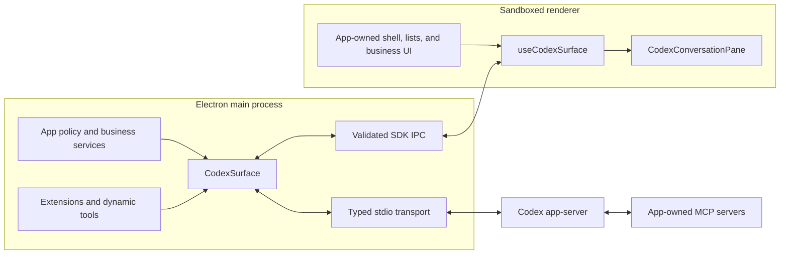

# codex-app-sdk

Build full-featured desktop applications on top of Codex app-server without
making every application reimplement process management, JSON-RPC, Electron
IPC, conversation state, and chat UI.

[](./LICENSE)
[](./package.json)
[](https://vuejs.org/)

`codex-app-sdk` is a high-level Codex runtime, a narrow validated Electron
bridge, and a complete Vue conversation kit. It owns the reusable plumbing and
UI; your app owns its product shell, policy, business data, and integrations.

The basic renderer can be this small:

```vue
<script setup lang="ts">
import { CodexConversationPane, useCodexSurface } from 'codex-app-sdk/vue';
import 'codex-app-sdk/styles.css';

const surface = useCodexSurface(window.codexSurface);
</script>

<template>
  <MyConversationList
    :active-id="surface.state.activeConversationId"
    :conversations="surface.state.conversations"
    @create="surface.createConversation()"
    @select="surface.selectConversation($event)"
  />
  <CodexConversationPane :surface="surface" />
</template>
```

No raw app-server method names, generated protocol payloads, Node primitives,
or Electron objects need to cross into the renderer.

> **Project status:** the SDK is currently `0.1.x` and source-first. The public
> surface API is intentionally much smaller than Codex app-server, but the
> generated low-level client remains available for advanced integrations.

## Contents

- [Why this SDK exists](#why-this-sdk-exists)
- [What is included](#what-is-included)
- [Architecture](#architecture)
- [Requirements and installation](#requirements-and-installation)
- [Quick start](#quick-start)
- [Configure the surface](#configure-the-surface)
- [Authentication](#authentication)
- [Concurrent conversations and events](#concurrent-conversations-and-events)
- [Extensions, dynamic tools, and MCP](#extensions-dynamic-tools-and-mcp)
- [Vue conversation kit](#vue-conversation-kit)
- [Samples](#samples)
- [Public entry points](#public-entry-points)
- [Security boundary](#security-boundary)
- [Advanced app-server client](#advanced-app-server-client)
- [Development](#development)
- [Compatibility and lifecycle notes](#compatibility-and-lifecycle-notes)
- [License](#license)

## Why this SDK exists

Codex app-server is a rich, evolving, bidirectional JSON-RPC protocol. A real
desktop product needs substantially more than a request helper:

- executable discovery and app-server lifecycle management;
- request correlation, notifications, server requests, reconnects, and schema
  compatibility;
- several simultaneously active conversations with independent streaming
  state;
- authentication, models, skills, plugins, permissions, approvals, goals,
  plans, rate limits, context usage, and persisted history;
- native file picking, paste and drag/drop, clipboard, audio capture, and
  transcription;
- a constrained main/preload/renderer boundary;
- a polished conversation UI that applications can theme and simplify without
  forking it.

Those concerns are generic. Workspace bars, settings screens, cockpits,
business dashboards, GitHub workflows, and other product-specific experiences
are not. The SDK keeps that boundary explicit.

## What is included

| Layer | What it owns |
| --- | --- |
| High-level surface | App-server startup, account state, catalogs, conversation discovery, history, concurrent live turns, actions, approvals, and semantic events |
| Node runtime | Codex executable discovery, JSONL-over-stdio transport, host-only defaults, extensions, dynamic tools, and MCP configuration |
| Electron bridge | Narrow typed IPC, validated renderer actions, native file/clipboard/link/transcription capabilities, and cleanup |
| Vue kit | `CodexConversationPane`, composer, message list, tools, approvals, generated media, thinking, goals, queues, menus, and reusable leaf components |
| Low-level client | Generated app-server request/response types, typed notifications, server-request responders, and replaceable transport |

Out of the box, the default conversation pane supports:

- global persisted conversation discovery with no implicit `cwd` filter;
- creation, selection, rename, archive, unarchive, and permanent deletion;
- multiple conversations streaming concurrently;
- model and reasoning selection, permissions, approval presets, plan mode,
  goals, reviews, compaction, interruption, steering, retry, edit, and rollback;
- native attachments, image paste/drop, host-provided file mentions, skills,
  plugins, slash commands, copy/quote actions, and Apple speech transcription
  on supported macOS hosts;
- Markdown, syntax highlighting, Mermaid, tool groups, confirmation requests,
  thinking shimmer, context usage, git diff summaries, queued prompts, and
  generated-image media with fullscreen/download/prompt presentation;
- restored history and live app-server events through the same serializable
  `SurfaceMessage` model.

## Architecture



Snapshots are the authoritative state and resynchronization mechanism.
Ordered semantic events provide incremental integration after the matching
snapshot mutation has already been applied.

## Requirements and installation

- Node.js 22 or newer;
- Vue 3.5 or newer for the Vue package;
- Electron for the included desktop bridge;
- a compatible Codex executable available to discovery, or an explicit
  transport command.

Until an npm release is published, install directly from GitHub:

```bash
npm install github:nbonamy/codex-app-sdk vue
npm install --save-dev electron
```

For repository development:

```bash
git clone git@github.com:nbonamy/codex-app-sdk.git
cd codex-app-sdk
npm install
```

The SDK searches the normal GUI-app locations for Codex, including login-shell,
Homebrew, user-bin, nvm, and Windows `PATHEXT` paths. Override the command only
when your application manages a specific executable:

```ts
const surface = createCodexSurface({
  transport: { command: '/absolute/path/to/codex' },
});
```

## Quick start

### 1. Main process

Create one surface and register the complete surface/native bridge. Trusted
policy and configuration paths belong here, not in renderer code.

```ts
import path from 'node:path';
import { app, BrowserWindow, clipboard, dialog, ipcMain, shell } from 'electron';
import { registerCodexElectronMain } from 'codex-app-sdk/electron';
import { createCodexSurface } from 'codex-app-sdk/node';

await app.whenReady();

const mainWindow = new BrowserWindow({
  webPreferences: {
    contextIsolation: true,
    nodeIntegration: false,
    preload: path.join(import.meta.dirname, 'preload.cjs'),
    sandbox: true,
  },
});
const surface = createCodexSurface();

const unregisterSdk = registerCodexElectronMain({
  clipboard,
  dialog,
  ipcMain,
  shell,
  surface,
  sender: {
    send: (channel, payload) => mainWindow.webContents.send(channel, payload),
  },
});

app.on('before-quit', () => {
  unregisterSdk();
  void surface.close();
});
```

Production windows should keep `contextIsolation: true`, `nodeIntegration:
false`, and `sandbox: true`. The samples also deny renderer navigation and open
links with supported protocols externally.

### 2. Preload

```ts
import { contextBridge, ipcRenderer } from 'electron';
import { exposeCodexElectronPreload } from 'codex-app-sdk/electron/preload';

exposeCodexElectronPreload(contextBridge, ipcRenderer);
```

This exposes two narrow APIs:

- `window.codexSurface` for safe surface state and actions;
- `window.codexAppSdkNative` for validated native capabilities.

Declare those globals once in your renderer types:

```ts
import type {
  CodexNativeRendererApi,
  CodexSurfaceRendererApi,
} from 'codex-app-sdk/electron';

declare global {
  interface Window {
    codexAppSdkNative: CodexNativeRendererApi;
    codexSurface: CodexSurfaceRendererApi;
  }
}

export {};
```

### 3. Renderer

```vue
<script setup lang="ts">
import { CodexConversationPane, useCodexSurface } from 'codex-app-sdk/vue';
import 'codex-app-sdk/styles.css';

const surface = useCodexSurface(window.codexSurface);
</script>

<template>
  <div class="app-shell">
    <MyConversationList
      :conversations="surface.state.conversations"
      :active-conversation-id="surface.state.activeConversationId"
      @create="surface.createConversation()"
      @select="surface.selectConversation($event)"
    />
    <CodexConversationPane :surface="surface" autofocus />
  </div>
</template>
```

The bound pane auto-connects and owns standard settings, approvals, goals,
attachments, copy, native picker, image paste/drop, and voice-transcription
wiring. Your app still owns its header, navigation, and product UI.

See [`samples/basic`](./samples/basic) for the complete Electron lifecycle,
preload typing, navigation policy, custom conversation list, and HMR setup.

## Configure the surface

Host-owned identity, policy, and defaults stay in the main process:

```ts
import path from 'node:path';
import { app } from 'electron';
import { createCodexSurface } from 'codex-app-sdk/node';

const surface = createCodexSurface({
  clientInfo: { name: 'my_app', title: 'My App', version: '0.1.0' },
  codexHome: path.join(app.getPath('userData'), 'codex-home'),
  permissionMode: 'read-only',
  approvalMode: 'ask',
});
```

Key rules:

- `codexHome` applies only to the spawned app-server child; it does not mutate
  the parent process and never crosses IPC.
- Conversation defaults apply to explicit creation when omitted and to implicit
  first-send, goal, and review creation paths.
- A host may pin `conversationDefaults.model` and `reasoningEffort` when it
  knows they are available in the app-server model catalog.
- The SDK does not send a working directory unless the host deliberately
  configures one.
- A configured `cwd` scopes new conversations, not global persisted
  conversation discovery.
- Filesystem/network policy, raw approval/permission modes, MCP commands,
  environments, and custom tool implementations remain main-process concerns.
  Renderer approval-preset selection is shape-checked and limited to the
  app-server-advertised preset catalog.

`CodexSurface` and its stable `conversation(id)` handles provide high-level
operations for connection, discovery, creation, history, settings, messaging,
queues, steering, interruption, compaction, reviews, goals, approvals, client
requests, message mutation, rollback, archive/delete, state/event subscriptions,
and cleanup.

## Authentication

Authentication is projected directly from app-server `account/read`. A
signed-out surface is still ready, which lets an app render its own landing
screen instead of treating sign-in as a transport failure.

```ts
await surface.connect();

const auth = surface.getSnapshot().authentication;
if (auth.account === null && auth.requiresOpenaiAuth === true) {
  const { authUrl } = await surface.startChatGptLogin();
  await shell.openExternal(authUrl);
}
```

The SDK handles `account/login/completed`, refreshes auth-dependent catalogs and
conversations, and makes the same mounted surface immediately usable. It also
exposes `cancelLogin()`, `refreshAccount()`, and `logout()` through the typed
bridge.

For an isolated product identity, give the surface its own `codexHome` as Spark
does. If a host replaces credentials whose app-server account payload has no
distinguishable identity, restart the surface so app-server and SDK state begin
from the same session.

## Concurrent conversations and events

Every loaded conversation has independent runtime state. `conversation(id)`
returns a stable handle, so background agents can continue without changing the
conversation selected in the UI:

```ts
const build = surface.conversation(buildThreadId);
const tests = surface.conversation(testThreadId);

await Promise.all([
  build.load({ extensionContext: { agentId: 'build' } }),
  tests.load({ extensionContext: { agentId: 'tests' } }),
]);

build.onStateChange(renderBuildState);
tests.onStateChange(renderTestState);

await Promise.all([
  build.sendMessage('Implement the feature'),
  tests.sendMessage('Exercise the risky boundaries'),
]);
```

Conversation snapshots expose their own messages, active turn, turn IDs,
approvals, queues, goal, settings, history-loading state, and errors.

The semantic event stream is protocol-free, ordered, and emitted after state
mutation:

```ts
surface.onEvent((event) => {
  if (event.type === 'tool.completed') {
    refreshBusinessState(event.conversationId);
  }
});
```

Events cover surface lifecycle, authentication, catalogs, conversation
summaries, settings, messages, turns, tools, plans, approvals, client requests,
goals, diffs, queues, rate limits, and history replacement. Each event carries
a monotonic sequence number and an `action`, `notification`, or `lifecycle`
origin.

## Extensions, dynamic tools, and MCP

### Host extensions and dynamic tools

Extensions can add developer instructions, start/resume configuration, and
app-owned dynamic tools without exposing JSON-RPC responders:

```ts
const surface = createCodexSurface({
  extensions: [{
    configureConversation: ({ operation, extensionContext }) => {
      const context = extensionContext as { agentId?: string } | undefined;
      return {
        developerInstructions: `Product agent (${operation})`,
        ...(context?.agentId
          ? { config: { product_agent: context.agentId } }
          : {}),
      };
    },
    dynamicTools: [{
      name: 'lookup_ticket',
      description: 'Look up a support ticket by id',
      inputSchema: {
        type: 'object',
        properties: { id: { type: 'string' } },
        required: ['id'],
      },
      execute: async ({ arguments: input }) => {
        return JSON.stringify(await lookupTicket((input as { id: string }).id));
      },
    }],
  }],
});
```

`extensionContext` is opaque host-only data retained per conversation. It is
available to configuration and tool execution but never enters snapshots or
renderer IPC.

### App-owned MCP servers

Register trusted stdio or HTTP MCP servers directly on the surface:

```ts
const surface = createCodexSurface({
  mcpServers: [{
    name: 'operations',
    transport: {
      type: 'stdio',
      command: process.execPath,
      args: [mcpServerPath],
      cwd: path.dirname(mcpServerPath),
      env: { OPERATIONS_STATE_PATH: statePath },
    },
    toolApprovalMode: 'writes',
    required: true,
    enabledTools: ['list_exceptions', 'get_shipment', 'rebook_shipment'],
    startupTimeoutMs: 10_000,
    toolTimeoutMs: 30_000,
  }],
});
```

The definitions are compiled to app-server configuration in the main process.
They never enter snapshots or renderer IPC. MCP calls use normal tool rendering,
progress, confirmations, and semantic tool events.

Per-conversation host options can replace the surface MCP list; `[]` disables
SDK-provided definitions for that conversation. Definitions are initial thread
configuration, not a hot-swap API. Use surface defaults for automatically
restored conversations, or explicitly load a conversation with its host options.

## Vue conversation kit

The primary component is a deliberately headerless
`CodexConversationPane`. Apps decide whether they need a header and what it
contains. The pane composes:

- history loading and empty/error states;
- message list and rich message blocks;
- thinking and streaming status;
- composer, menus, models, reasoning, permissions, plan mode, and attachments;
- goals, queued prompts, turn git diff, context usage, approvals, and app-server
  questions.

The Vue package also exports the independently reusable composer, menu, message,
tool, approval, layout, media, Mermaid, goal, queue, and native-capability
components. Use `CodexWorkbenchLayout` when you want a measured sticky
header/footer frame without adopting an app-specific header.

### Simplify the default UI

Capabilities control behavior; presentation controls decide which supported UI
is visible. An app can build a simple chat surface without internal CSS hacks:

```ts
import type {
  CodexCapabilities,
  CodexConversationPresentation,
} from 'codex-app-sdk/vue';

export const capabilities: CodexCapabilities = {
  models: false,
  skills: false,
  reasoningEffort: false,
  planMode: false,
  goals: false,
  steerPrompt: false,
  interrupt: true,
  history: true,
  rollback: false,
  editMessage: false,
  retryMessage: false,
  approvals: false,
  approvalPresets: [],
};

export const presentation: CodexConversationPresentation = {
  composer: { actionMenu: false, contextUsage: false, voice: false },
  messages: {
    actions: { copy: false, delete: false, edit: false, quote: false, retry: false },
    toolBlocks: false,
  },
  shelf: { goal: false, queuedPrompts: false, turnGitDiff: false },
};
```

```vue
<CodexConversationPane
  :surface="surface"
  :capabilities="capabilities"
  :presentation="presentation"
/>
```

Generated images remain visible as rich media even when technical tool blocks
are hidden. Disabled attachment or transcription capabilities remove their
controls instead of leaving dead buttons.

### Slots and custom controls

The pane forwards scoped slots for empty state, full messages, message blocks,
text, attachments, tools, thinking, actions, approvals, composer content, menu
trigger, menu entries, and custom composer actions. Customize media through the
general message-block slot or mount the exported `CodexMediaBlock` directly.
`CodexComposerMenu` supports nested actions, checkboxes, radio items, headings,
separators, submenus, roving focus, keyboard navigation, and Escape focus
restoration.

### Themes and sizing

Import `codex-app-sdk/styles.css` once. SDK components scope their complete
default styles under `.codex-chat-theme`, so they do not reset the host app.

Choose light, dark, or system mode with `data-codex-theme`, a theme class, or
the optional `applyCodexTheme()` helper. Override public semantic tokens on an
ancestor:

```css
.my-codex-surface {
  --codex-font-family: Inter, ui-sans-serif, system-ui, sans-serif;
  --codex-primary-color: #3659d9;
  --codex-background-color: #fafbff;
  --codex-surface-color: #fff;
  --codex-message-font-size: 16px;
  --codex-message-line-height: 24px;
  --codex-composer-font-size: 16px;
  --codex-composer-control-size: 42px;
  --codex-menu-font-size: 14px;
  --codex-menu-control-min-height: 34px;
  --codex-message-action-control-size: 30px;
}
```

Colors, typography, menus, icons, message blocks, composer states, thinking,
history loading, and interaction feedback all have SDK-owned defaults. Host CSS
should style the shell and documented tokens/slots, not internal classes.

## Samples

Three Electron + Vue applications exercise different SDK boundaries:

| Sample | Product shape | What it proves | Run |
| --- | --- | --- | --- |
| [`basic`](./samples/basic) | Custom conversation sidebar + stock pane | Minimal renderer code, global app-server threads, concurrent turns, full composer/native features, permanent deletion, HMR | `cd samples/basic && npm run dev` |
| [`kids`](./samples/kids) | Spark, a focused child-friendly chatbot | Isolated `CODEX_HOME`, signed-out landing, fixed model/default reasoning, simple presentation controls, semantic theming | `npm run kids:dev` |
| [`relay`](./samples/relay) | Single-conversation logistics exception desk | App-owned business UI, contextual prompts, stdio MCP tools, write confirmations, business-state refresh | `npm run relay:dev` |

Production-style start commands build before launching Electron:

```bash
npm run sample:start
npm run kids:start
npm run relay:start
```

The samples deliberately keep product UI outside the SDK. Basic owns its
conversation list, Spark owns its identity and simplified shell, and Relay owns
its operations board and MCP business logic. All three reuse the same surface,
IPC, and conversation-component contracts while choosing their own capabilities
and presentation.

Spark demonstrates UI customization; it is not a child-safety system. Relay's
MCP server uses a seeded local JSON store to demonstrate the integration seam;
it is not a production logistics backend.

## Public entry points

| Import | Intended use |
| --- | --- |
| `codex-app-sdk/node` | High-level `CodexSurface`, stdio transport, discovery, history adapters, extensions, and MCP types |
| `codex-app-sdk/electron` | Main-process registration plus reusable typed IPC primitives |
| `codex-app-sdk/electron/preload` | Context-bridge-safe preload APIs |
| `codex-app-sdk/vue` | Reactive surface controller and complete Vue component kit |
| `codex-app-sdk/styles.css` | Scoped default component styles and public theme tokens |
| `codex-app-sdk/surface` | Framework-neutral serializable surface contracts |
| `codex-app-sdk/codex` | Advanced typed app-server client and generated method types |
| `codex-app-sdk/events` | Framework-neutral typed event bus |
| `codex-app-sdk` | Core aggregate exports for protocol, Electron, events, and surface contracts |

Normal Electron + Vue apps generally need only `node`, `electron`,
`electron/preload`, `vue`, and `styles.css`.

## Security boundary

The SDK treats the main process as the trusted policy boundary.

| Main process only | Safe renderer surface |
| --- | --- |
| `CODEX_HOME`, cwd, raw approval/permission modes, and thread config | Serializable account, catalog, conversation, message, approval, and status snapshots |
| MCP commands, paths, environment values, enabled tools | Validated high-level actions and semantic events |
| Extension context and dynamic tool implementations | Presentation/capability choices and app-owned UI state |
| App-server transport and generated protocol types | Native capability methods with validated payloads |

The renderer cannot submit raw thread configuration, MCP definitions, commands,
environment values, or generated JSON-RPC envelopes through the high-level IPC
API. It can select only an approval preset advertised by app-server; unknown
input keys are rejected. Hiding a preset in the Vue presentation is not an
authorization boundary. File, clipboard, external-link, and audio operations
use explicit native handlers rather than exposing Node.

The SDK intentionally contains no product-specific GitHub integration, agent
workspace shell, settings screen, or business backend. Add those in your app or
through trusted extensions/MCP servers.

## Advanced app-server client

The low-level client is available when app-server adds a capability that the
high-level surface has not projected yet:

```ts
import { CodexAppServerClient } from 'codex-app-sdk/codex';
import { CodexAppServerStdioTransport } from 'codex-app-sdk/node';

const client = new CodexAppServerClient(new CodexAppServerStdioTransport());
await client.start();
await client.initialize({
  clientInfo: { name: 'my_surface', title: 'My Surface', version: '0.1.0' },
  capabilities: { experimentalApi: true, requestAttestation: false },
});

const { thread } = await client.request('thread/start', {});

client.onNotification('item/agentMessage/delta', ({ params }) => {
  console.log(params.delta);
});

client.onServerRequest('item/tool/requestUserInput', (_request, responder) => {
  responder.resolve({ answers: {} });
  return true;
});
```

The client handles correlation, timeouts, notifications, transport failure, and
server-request responses while preserving generated method types. Adapt
protocol-specific payloads before they cross IPC. If ordinary renderer code
needs raw `thread/*`, `turn/*`, or JSON-RPC types, the high-level boundary should
probably be extended instead.

## Development

```bash
npm install
npm test
npm run typecheck
npm run build
```

Additional gates:

```bash
npm run test:coverage
npm run sample:test
npm run kids:test
npm run kids:typecheck
npm run kids:build
npm run relay:test
npm run relay:typecheck
npm run relay:build
```

The production build emits JavaScript, declarations, source maps, and the scoped
stylesheet. The Apple speech helper ships separately through the package's
`assets` directory. Package-boundary tests verify the public component and
stylesheet inventories.

### Generated app-server types

Codex app-server's schema is version-specific. Regenerate checked-in bindings
from the local Codex executable with:

```bash
npm run schema:generate
```

The generator records its source CLI version and creates request/response and
notification maps. Do not hand-edit generated files.

## Compatibility and lifecycle notes

- The package targets Node 22+ and Vue 3.5+.
- Vue is a peer dependency, so applications own their renderer runtime.
- The checked-in app-server schema was generated from `codex-cli 0.144.1` and
  includes experimental APIs required by rich surfaces. Unknown notifications
  can be observed through
  `onUnknownNotification` while the SDK catches up to a newer server.
- Fatal transport failures move the surface to an error state. Calling
  `connect()` starts and initializes a fresh app-server process.
- MCP definitions apply on thread start/resume; they are not hot-swapped into an
  already-running thread.
- The default surface reads the app-server's global non-archived conversation
  catalog. Cloud-only ChatGPT conversations that app-server cannot expose are
  outside this SDK's data source.

## License

Licensed under the [Apache License, Version 2.0](./LICENSE).
